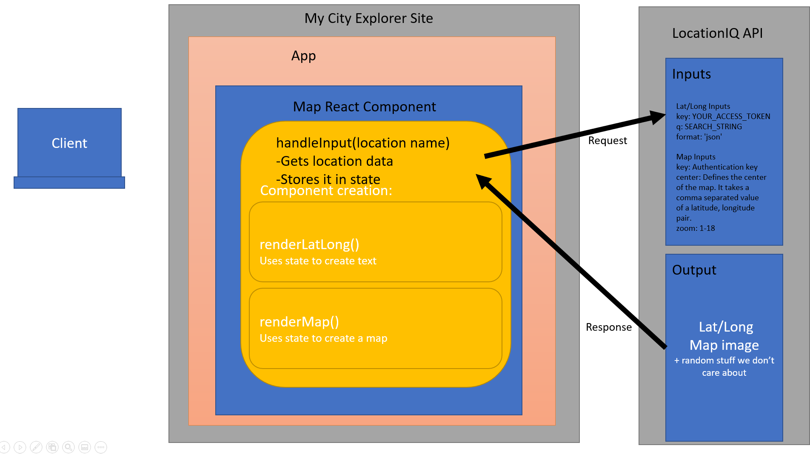
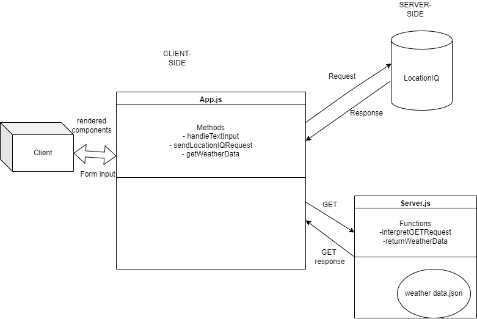

# City Explorer

**Author**: Jeffrey Jenkins

**Version**: 1.2.0

## Overview
<!-- Provide a high level overview of what this application is and why you are building it, beyond the fact that it's an assignment for this class. (i.e. What's your problem domain?) -->

## Getting Started
<!-- What are the steps that a user must take in order to build this app on their own machine and get it running? -->

## Architecture
<!-- Provide a detailed description of the application design. What technologies (languages, libraries, etc) you're using, and any other relevant design information. -->

## Change Log
<!-- Use this area to document the iterative changes made to your application as each feature is successfully implemented. Use time stamps. Here's an example:

01-01-2001 4:59pm - Application now has a fully-functional express server, with a GET route for the location resource. -->

## Credit and Collaborations

- Referred to [MDN doc](https://developer.mozilla.org/en-US/docs/Web/HTML/Element/map) on the Image Map element to create the Map component.

- Used Google Font [Lobster](https://fonts.google.com/specimen/Lobster)

## Web Request Diagrams

### Lab 06: Co-authored with Matt Rangel

### Lab 07: Co-authored with Dan Brian

## Test estimates

### Lab 06 time estimates

1. **Feature #1: Setup**
    - Estimate of time needed to complete: 30 minutes
    - Start time: 3:06 PM
    - Finish time: 3:39 PM
    - Actual time needed to complete: 33 minutes

2. **Feature #2: Locations**
    - Estimate of time needed to complete: 30 minutes
    - Start time: 3:39 PM
    - Finish time: 4:54 PM
    - Actual time needed to complete: 75 minutes

3. **Feature #3: Map**
    - Estimate of time needed to complete: 30 minutes
    - Start time: 5:22 PM
    - Finish time: 5:45 PM
    - Actual time needed to complete: 33 minutes

4. **Feature #4: Error**
    - Estimate of time needed to complete: 30 minutes
    - Start time: 6:45 PM
    - Finish time: 8:30 PM
    - Actual time needed to complete: 105 minutes

### Lab 07 time estimates

1. **Feature #2: Weather (placeholder)**
    - Estimate of time needed to complete: 30 minutes
    - Start time: 10:45 PM
    - Finish time: 11:40 PM
    - Actual time needed to complete: 55 minutes
. **Feature 3: Error (revisited)**
    - Estimate of time needed to complete: 30 minutes
    - Start time: 11:40 PM
    - Finish time: 12:59 PM
    - Actual time needed to complete: 45 minutes
