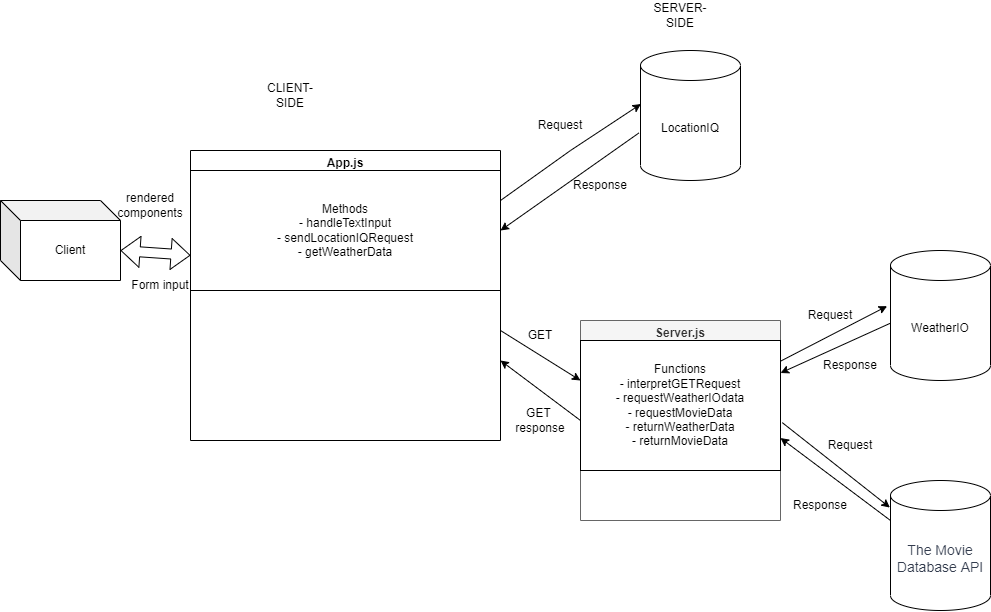
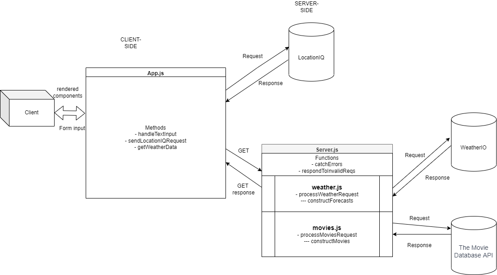

# City Explorer

**Author**: Jeffrey Jenkins

**Version**: 1.4.2

## Overview

This application shows data on location which the user has searched for, including a rendered map of the location, a weather forecast, and movies which are are related to the location.

## Getting Started
<!-- What are the steps that a user must take in order to build this app on their own machine and get it running? -->

## Architecture
<!-- Provide a detailed description of the application design. What technologies (languages, libraries, etc) you're using, and any other relevant design information. -->

## Change Log
<!-- Use this area to document the iterative changes made to your application as each feature is successfully implemented. Use time stamps. Here's an example:

01-01-2001 4:59pm - Application now has a fully-functional express server, with a GET route for the location resource. -->

## Credit and Collaborations

- Referred to [MDN doc](https://developer.mozilla.org/en-US/docs/Web/HTML/Element/map) on the Image Map element to create the Map component.

- Referred to [Bootstrap Carousel doc](https://getbootstrap.com/docs/4.0/components/carousel/) to make movie poster display.

- Used Google Font [Lobster](https://fonts.google.com/specimen/Lobster)

- Referred to this [Reactgo.com article](https://reactgo.com/react-disable-button-input-empty/) for making a form button which is disabled when input is empty.

## Web Request Diagrams

### Lab 06: Co-authored with Matt Rangel

### Lab 07: Co-authored with Dan Brian

### Lab 08: An iteration on the Lab 07 diagram, co-authored with Nicholas Mercado

The Lab 07 diagram was used with Dan Brain's permission.

### Lab 09: An iteration on the Lab 08 diagram, co-authored with Brady Camp

Server JS's functions have been broken up into modules.

## Test estimates

### Lab 06 time estimates

1. **Feature #1: Setup**
    - Estimate of time needed to complete: 30 minutes
    - Start time: 3:06 PM
    - Finish time: 3:39 PM
    - Actual time needed to complete: 33 minutes

2. **Feature #2: Locations**
    - Estimate of time needed to complete: 30 minutes
    - Start time: 3:39 PM
    - Finish time: 4:54 PM
    - Actual time needed to complete: 75 minutes

3. **Feature #3: Map**
    - Estimate of time needed to complete: 30 minutes
    - Start time: 5:22 PM
    - Finish time: 5:45 PM
    - Actual time needed to complete: 33 minutes

4. **Feature #4: Error**
    - Estimate of time needed to complete: 30 minutes
    - Start time: 6:45 PM
    - Finish time: 8:30 PM
    - Actual time needed to complete: 105 minutes

### Lab 07 time estimates

1. **Feature #2: Weather (placeholder)**
    - Estimate of time needed to complete: 30 minutes
    - Start time: 10:45 PM
    - Finish time: 11:40 PM
    - Actual time needed to complete: 55 minutes
2. **Feature #3: Error (revisited)**
    - Estimate of time needed to complete: 30 minutes
    - Start time: 11:40 PM
    - Finish time: 12:59 PM
    - Actual time needed to complete: 45 minutes

### Lab 08 time estimates

1. **Feature #1: Weather (live)**
    - Estimate of time needed to complete: 60 minutes
    - Start time: 6:00 PM
    - Finish time: 8:25 PM
    - Actual time needed to complete: 100 minutes
2. **Feature #2: Movies**
    - Estimate of time needed to complete: 30 minutes
    - Start time: 8:30 PM
    - Finish time: 11:19 PM
    - Actual time needed to complete: 154 minutes

### Lab 09 time estimates

1. **Feature #2: Componentize Front-End**
    - Estimate of time needed to complete: 30 minutes
    - Start time: 12:41 PM
    - Finish time: 3:41 PM
    - Actual time needed to complete: 100 minutes (breaks excluded)
